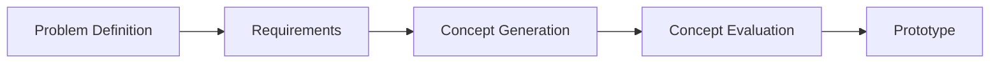

# Engineering Handbook

This handbook summarises a list of tools and methods which could be combined into an engineering process.

## What is Engineering?

Engineering is simply a process for solving problems and consists of the following steps.

The engineering process asks:
- `Problem Definition`: What is the problem we are trying to solve?
- `Requirements`: What are the metrics our solutions needs to achieve?
- `Concept Generation`: What are some possible solutions?
- `Concept Evaluation`: What is the best solution?
- `Prototype`: Can we develop a solution?

Each engineering step will further consist of many more tools and methods.
