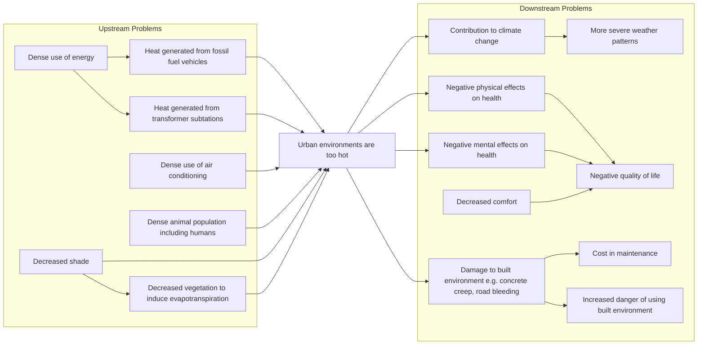

# Problem Definition

A client/user will first approach the engineer with a problem. It is then our job to translate the client's problem into a language for the engineering team to understand.

## Problem Brainstorming

### Problem Tree

A problem tree can be used to help define the problem. It shows the relationship between the root user problem with cause and effect relationship with related problems. Filling out a problem tree allows an engineering team to brainstorm and categorise problems.

Example

Consider that *urban environments are too hot*:

Some pitfalls to consider:
- Problems that extend far upstream and downstream of the root problem are outside the scope of the project.
- Problems that are cohesive but each written explicitly will increase the scope of problem definition.

> It is during this step that conducting research (and statistics) is strongly recommended!

### Objective Tree

Objective trees can be used following problem trees and before problem definition which shows a one-to-one positive outcome of the problem tree.

Opinion

I would not recommend using this because:
- Solving a problem has more complex outcomes than a one-to-one relationship.
- Not every problem **needs** to be solved and thus have a positive outcome.
- This increases documentation overhead when it is implicitly an inverse of the problem tree.

## Problem Statement

A problem statement is a description of the problem that guides a team of engineers towards a solution. Problem statements should:
- Translate the user's needs into an engineering context.
- Be independent to the solution (unless required by the user's needs).
- Strike a balance between ambiguity and preciseness. This depends on the scope of the project i.e.:
    - How much time do we have to solve the problem?
    - What is the project's budget?

Example

Examples of good problem statements would be:
- d

Examples of bad problem statements would be:
- d

