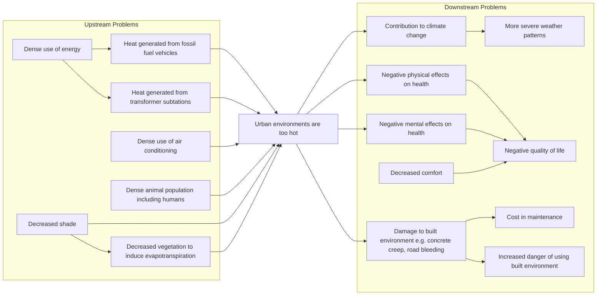

# Problem Definition

A problem statement is a description of the problem that guides a team of engineers towards a solution. Problem statements should:
- Translate the user's needs into an engineering context.
- Be independent to the solution (unless required by the user's needs).
- Strike a balance between ambiguity and preciseness.

## Problem Tree

A problem tree can be used to help define the problem. It shows the relationshp between the root user problem with cause and effect relationship with related problems. Filling out a problem tree allows an engineering team to brainstorm and categorise problems.

For example, considering that "urban environments are too hot":


Some pitfalls to consider:
- There will exist subproblems that extend far upstream and downstream of the root problem. These are outside the scope of the engineering project and should not be considered in the problem definition.
- There will exist poly-branchable subproblems that will increase the scope of the problem definition and may drive problem definition to solving a distantly-related problem. For example, we don't need to consider "concrete creep", "road bleeding", and "road cracking":
    ```mermaid
    flowchart LR
        A[Damage to built environment]
        B[Concrete creep]
        C[Road bleeding]
        D[Road cracking]
        E[Cost in maintenance]
        A --> B
        A --> C
        A --> D
        B --> E
        C --> E
        D --> E
    ```

## Objective Tree

Objective trees can be used following problem trees and before problem definition which shows a one-to-one positive outcome of the problem tree.

I would not recommend using this because:
- Solving a problem has more complex outcomes than a one-to-one relationship.
- Not every problem **needs** to be solved and thus have a positive outcome.
- This increases documentation overhead when it is implicitly an inverse of the problem tree.
